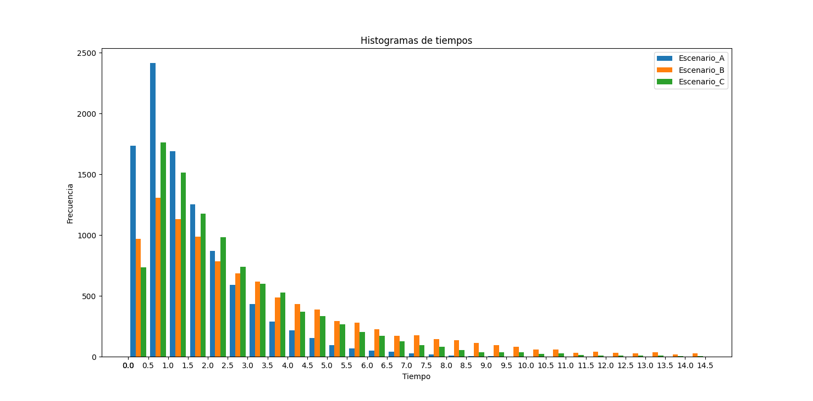
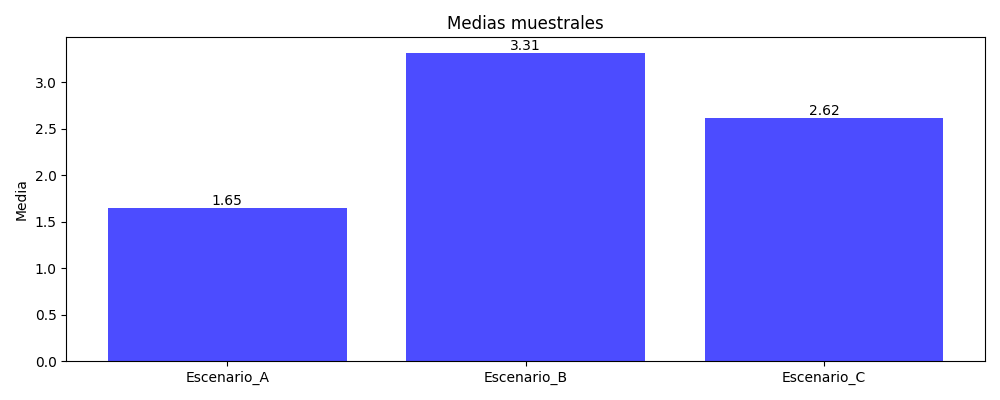
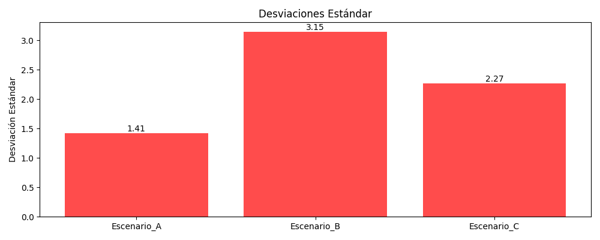

# Reporte - Sistema con operarios - A Repair problem

### Integrantes
- [Ebner Lautaro](lautaro.ebner@mi.unc.edu.ar)
- [Molina Franco](franco.molina13@mi.unc.edu.ar)

## Introduccion
### Presentacion del problema
En este informe, abordamos la simulación de un modelo de reparación para un pequeño supermercado que cuenta con $N$ cajas registradoras en servicio y un conjunto de $S$ máquinas de repuesto. 
Las cajas registradoras son susceptibles a fallos y requieren reparación. 
El objetivo de este estudio es determinar el tiempo medio y la desviación estándar del tiempo hasta que el supermercado deje de ser operativo, es decir, cuando hay más de $S$ cajas registradoras en reparacion o defectuosas.

Para poder estudiar este problema, simularemos dos casos muy distinguidos:
1. **Simulación con un operario:** Aquí, modelamos el proceso de fallo y reparación de las cajas registradoras utilizando un operario. El operario repara una máquina a la vez, y los tiempos de fallo y reparación se modelan como variables aleatorias exponenciales con parámetros $T_{F}$ (tiempo medio hasta fallar) y $T_{R}$ (tiempo medio de reparación), respectivamente.
2. **Simulación con dos operarios:** En esta segunda parte, extendemos el modelo anterior para incluir dos operarios que trabajan en paralelo entre ellos. Cada operario puede reparar una máquina a la vez, lo que potencialmente reduce el tiempo total de reparación y aumenta el tiempo medio hasta el fallo del sistema.

### Procedimiento de Simulación
Para simular el modelo de reparación de las cajas registradoras, seguimos estos pasos:

1. **Definición de parámetros**:
    - $N$: Número de cajas registradoras en servicio.
    - $S$: Número de máquinas de repuesto.
    - $T_{F}$: Tiempo medio hasta que una caja registradora falla.
    - $T_{R}$: Tiempo medio de reparación de una caja registradora.
2. **Generación de tiempos de fallo y reparación**:
    - Utilizamos la distribución exponencial para modelar los tiempos de fallo y reparación.
    - El tiempo hasta que una caja registradora falla se genera como una variable aleatoria exponencial con media $T_{F}$.
    - El tiempo de reparación de una caja se genera como una variable aleatoria exponencial con media $T_{R}$.
3. **Simulación del proceso**:
    - Iniciamos con todas las cajas registradoras en funcionamiento.
    - Registramos los tiempos de fallo y reparamos las cajas de acuerdo con la disponibilidad del operario o de los dos operarios.
    - Mantenemos un registro de cuántas cajas están en reparacion o defectuosas y cuántas están operativas en cada momento.
    - La simulación se detiene cuando el número de cajas operativas cae por debajo de $N$, es decir, cuando más de $S$ cajas están en reparación o defectuosas.
4. **Cálculo del tiempo medio y la desviación estándar**:
   - Repetimos la simulación múltiples veces para obtener una distribución del tiempo hasta el fallo del sistema.
   - Calculamos el tiempo medio y la desviación estándar de esta distribución.
  
Este enfoque nos permitirá no solo entender el comportamiento del sistema bajo diferentes condiciones, sino también tomar decisiones informadas sobre cómo mejorar la operatividad del supermercado.

## Algoritmo y descripcion de las variables

Como ya mencionamos antes, los parametros de la simulacion utilizados fueron:

  - $N$: Número de cajas registradoras en servicio.
  - $S$: Número de máquinas de repuesto.
  - $T_{F}$: Tiempo medio hasta que una caja registradora falla.
  - $T_{R}$: Tiempo medio de reparación de una caja registradora.

Y las variables utilizadas en la simulacion 

  - t: Representa el tiempo en el que esta presente la simulacion.
  - cant_defectuosas: En todo momento es la cantidad de maquinas defectuosas que pueden o no estar siendo reparadas.
  - t_reparacion: Es una lista con los proximos tiempos en los que sera reparada una maquina. 
  - fallos: Es una lista con los proximos tiempos en los que se rompera una maquina.

A continuacion daremos una simple explicacion del algoritmo planteado.

### Inicializacion de tiempos de reparacion y fallos de maquinas
Inicializamos los tiempos de reparaciones en infinito, simbolizamos con esto que no se esta reparando ninguna maquina.
De manera similar, inicializamos generamos $N$ tiempos de falla para las maquinas y los ordenamos de menor a mayor.

### Bucle principal de la simulacion
Una vez completada la inicializacion, nos preguntamos cual es el proximo evento, es decir, si el proximo evento es un **fallo de una maquina** o una **finalizacion de una reparacion**. Realizamos esto hasta que el supermercado deje de ser operativo.

#### El proximo evento es un fallo de una maquina
En este caso, realizamos las siguientes actualizaciones o procedimientos:
- Adelantamos el tiempo de la simulacion a el tiempo del evento y actualizamos lacantidad de maquinas defectuosas.
- Si no se esta reparando una maquina, empezamos a repararla
- Luego del fallo de la maquina, el estado del supermercado puede seguir siendo operativo *(sigue habiendo maquinas de repuesto)* o dejar de serlo *(no hay mas maquinas de repuesto)*.
#### El proximo evento es una reparacion de una maquina
En este caso realizamos los siguientes cambios:
- Adelantamos el tiempo de la simulacion a el tiempo del evento y actualizamos lacantidad de maquinas defectuosas.
- Luego, nos fijamos si tenemos alguna maquina "esperando" a ser reparada, si este fuese el caso, empezamos a repararla actualizando el tiempo de reparacion, caso contrario, re-definimos el tiempo de reparacion como infinito.

## Presentacion de resulados
Con los algoritmos adjuntados realizamos simulaciones, correspondientes a:
- **Escenario A:** Supermercado con 7 cajas registradoras, 3 de repuesto y 1 operario
- **Escenario B:** Supermercado con 7 cajas registradoras, 3 de repuesto y 2 operario
- **Escenario C:** Supermercado con 7 cajas registradoras, 4 de repuesto y 1 operario
  
En todos los casos, el operario se tarda en promedio $1/8$ de mes en reparar una maquina, y las maquinas se rompen en promedio cada $1$ mes.
A continuacion, mostramos los datos obtenidos en histogramas:

  
  
  

## Conclusiones
Al ver los tres resultados podemos ponernos en la piel de un gerente de dicho establecimiendo y teniendo en cuenta que la siituacion actual del supermercado es el escenario A, nos proponemos tomar desiciones sobre que seria mas conveniente, agregar una caja registradora de repuesto o contratar a otro operario.

En el Escenario B nos planteamos la contratacion de un nuevo operario. Segun nuestras simulaciones podemos notar que en promedio pasamos de tener un promedio de tiempo de operatividad de $1.65$ a $3.31$ meses. Esto en promedio alarga mucho mas la duracion en la que el supermercado esta operativo pero tenemos que tener en cuenta que la desviacion estandar pasa de $1.41$ a $3.15$, lo que nos dice que los valores o resultados de las simulaciones son muy variados y poco seguros.

Por otro lado, en el Escenario C nos planteamos la compra de otra maquina de repuesto, manteniendo un operario. A travez de las simulaciones, obtenemos que en tanto a el promedio de tiempo de operatividad tenemos una mejora de $1.65$ a $2.62$. Notamos que la mejora no es tan grande como la del Escenario B, pero en su defensa podemos ver que su desviacion estandar empeoro de $1.41$ a $2.27$ en relacion a la del escenario A. Esta desviacion es mejor que la del Escenario B por lo que la simulacion es mas confiable.

En conclucion, tomar la desicion de contratar otro operario es considerablemente mejor en terminos promedio de tiempo de operatividad del supermercado, pero debido a que esto implica agregar otra variable a nuestra simulacion, incrementa la desviacion estandar por lo que los distintos resultados posibles son mas dispersos. 

Personalmente consideramos que la opcion B es mejor a pesar del riego que implica.